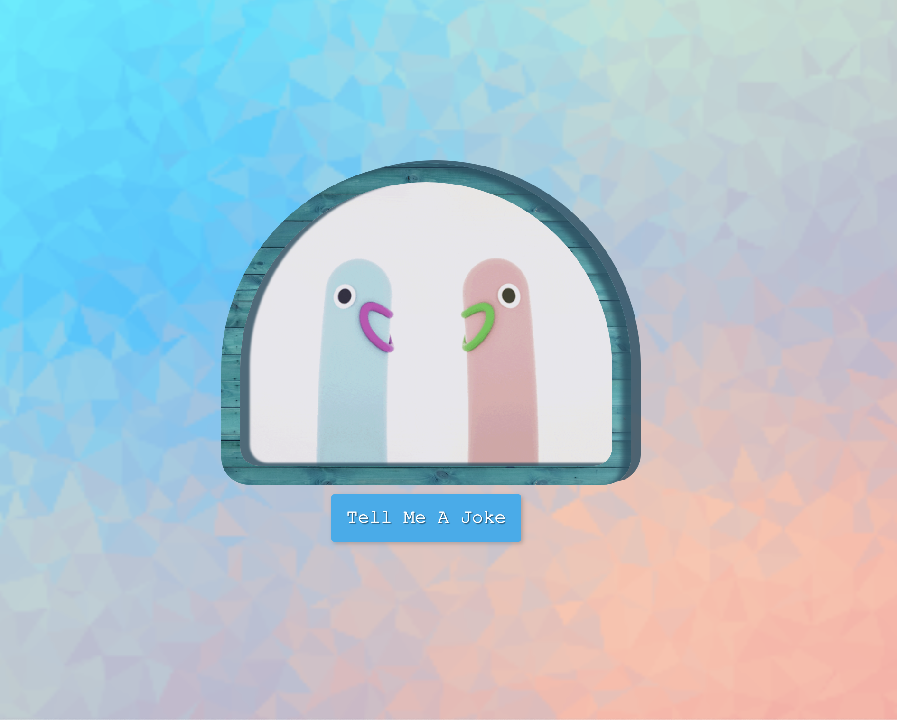

# joke-teller

## about
  - works by pressing button
  - joke-teller tell you a random joke about programming
  ---
## code info
  - Built with HTML, CSS and Javascript.
  - use [text to speech API](http://www.voicerss.org/)
  - use [joke API](https://sv443.net/jokeapi/v2/)

referenced ideas and codes from the ZMT JS course
[course-link](https://academy.zerotomastery.io/p/javascript-projects)

---